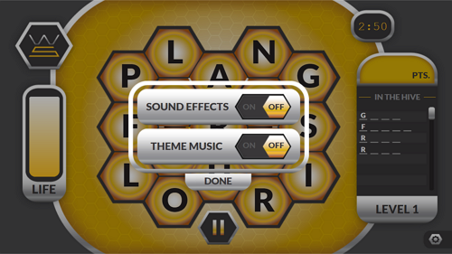
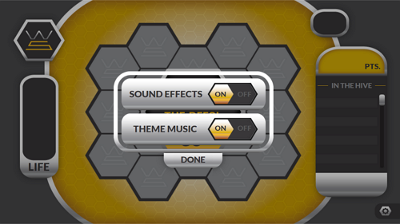
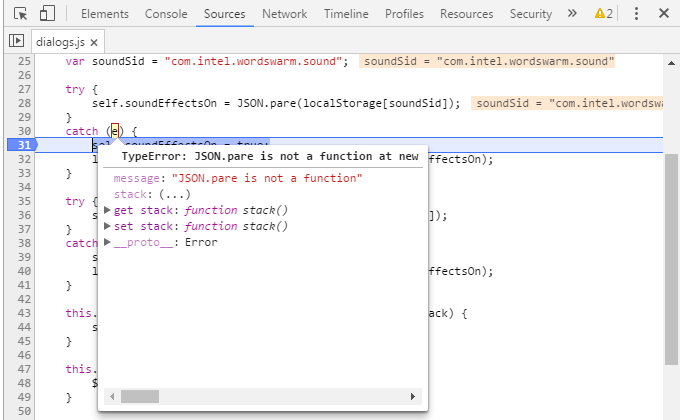

> 오픈 소스 프로젝트의 코드 오류에 관한 시리즈입니다.
>
> 개발 중인 정적 분석기의 유용성 검증, 코드 오류 패턴 수집 등의 목적으로 JavaScript 기반의 오픈 소스 프로젝트를 분석기로 진단해 보게 되었고 공유할 만한 내용을 추려 시리즈로 연재합니다.
{:.preface}

오늘의 분석 대상 프로젝트는 Intel이 진행했던 HTML5 Web Apps입니다.

* 프로젝트명: HTML5 Web Apps
* 프로젝트 사이트: https://01.org/html5webapps
* 프로젝트 설명: 최신 웹 기술 전시용으로 HTML5, JavaScript 그리고 CSS3만으로 작성된 순수 웹앱 샘플을 제공합니다. 샘플은 게임, 유틸리티 등 다양한 종류로서 20개가 제공됩니다.

## Wordswarm

[Wordswarm](https://01.org/html5webapps/online/wordswarm/)은 단어를 맞추는 게임입니다.
DOM 조작, CSS 애니메이션 같은 기술로 구현했고 게임 설정 저장을 위해 `localStorage`를 활용하고 있습니다.


제가 개발 중인 JavaScript 정적 분석기로 해당 앱의 소스를 크롤링해서 분석해 보았습니다.
브라우저 호환성과 false alarm을 제외하면 다음과 같은 코드 오류가 있다고 나왔네요.

| JSON.pare is undefined but is called as a function | js/dialogs.js:28 |
| JSON.pare is undefined but is called as a function | js/dialogs.js:36 |
| Result of expression this.soundEffectsOn is unused. | js/dialogs.js:13 |
| Result of expression this.themeMusicOn is unused. | js/dialogs.js:14 |
| The value assigned to variable textstyle is never used. | js/webappcommon.js:292 |

### 사용되지 않는 변수
**js/webappcommon.js:** The value assigned to variable textstyle is never used.
{: .notice}

정의한 변수를 사용하지 않는 경우입니다.
흔히 나오는 패턴이라서 사용되지 않는 코드 포스팅([1편]({{ site.baseurl }})과 [2편]({{ site.baseurl }}))에서는 따로 다루지 않았었습니다.

<pre class="line-numbers" data-start="287" data-line="6,9"><code class="language-javascript">webappCommon.TextScroller = function(divid, file, style)
{
    var self = this;
    var id = "webapp_textscroll";
    var css = "position: relative;";
    var textstyle = "font: 25px/100% Arial, Helvetica, sans-serif;text-align: center;";
    if(style == undefined)
    {
        css += "font: 25px/100% Arial, Helvetica, sans-serif;text-align: center;";
    }
    else
    {
        css += style;
    }
</code></pre>

`textstyle` 변수를 정의했는데 함수 내에서 해당 변수를 사용하는 곳이 없습니다.

295 라인에서 `css += textstyle;`로 작성하려고 했던 것 같은데 리팩토링이 완료되지 않은 상황으로 생각됩니다.

### 사용되지 않는 표현식
**js/dialogs.js:** Result of expression this.soundEffectsOn is unused.
{: .notice}

표현식의 결과를 사용하지 않는 경우입니다.

<pre class="line-numbers" data-start="10" data-line="4-5"><code class="language-javascript">function SettingDialog(onDialogCloseCallback)
{
    self = this;
    this.soundEffectsOn;
    this.themeMusicOn;

    var $settingPage = $('#setting_page');
</code></pre>

변수 선언을 하거나 초기화를 해야 할 위치인데 표현식만 사용되고 있어 아무런 의미 없는 코드가 됩니다.

### 잘못된 함수 호출
**js/dialogs.js:** JSON.pare is undefined but is called as a function
{: .notice}

`JSON` 객체의 `pare` 함수를 호출하고 있는데, 그런 함수는 없다고(undefined) 하네요.

`JSON` 객체는 브라우저에서 제공하는 내장(built-in) 객체로 [레퍼런스](https://developer.mozilla.org/en-US/docs/Web/JavaScript/Reference/Global_Objects/JSON)를 보면 `parse`라는 함수가 있어 문자열을 json 객체로 변환해 줍니다. 즉 아래 코드는 `JSON.parse`의 오타라는 것이죠.

<pre class="line-numbers" data-start="24" data-line="5"><code class="language-javascript">    var themeSid = "com.intel.wordswarm.theme";
    var soundSid = "com.intel.wordswarm.sound";

    try {
        self.soundEffectsOn = JSON.pare(localStorage[soundSid]);
    }
    catch (e) {
        self.soundEffectsOn = true;
        localStorage[soundSid] = JSON.stringify(self.soundEffectsOn);
    }
</code></pre>

이 오류가 게임 동작에 어떤 영향을 미칠까요? `localStorage`에 저장된 설정 값을 파싱하려다가 에러가 발생해 `catch`로 빠지게 되고 항상 true만 설정될 겁니다.

즉 사용자가 설정을 변경해도

{:width="50%"}

브라우저 리로딩 후에는 기본 설정으로 돌아가 버리는 것이죠.

{:width="50%"}

브라우저의 Inspector로 확인해 보면 TypeError가 실제로 발생하는 것을 알 수 있습니다.



그렇다면 정적 분석기는 소스만으로 이런 오류를 어떻게 알 수 있을까요?

브라우저에 어떤 내장 객체가 있고 해당 객체는 어떤 함수를 가지며 또 그 함수는 어떤 인자와 반환 값을 갖는지 알아야 체크가 가능하겠죠? 정적 분석기에서는 이를 모델링(modeling)이라 부르는데, 제가 개발 중인 JavaScript 정적 분석기는 브라우저 객체와 DOM API에 대한 모델링 정보를 갖고 있어 위와 같은 오류 검출이 가능합니다.

`JSON` 객체 모델링의 예:

```
  def getSemanticMap(): Map[String, SemanticFun] = {
    Map(
      ("JSON.parse",
        (h: Heap, he: Heap, cp: ControlPoint, iid: InstId, fun: String, args: CFGExpr, AS: AnalyzerState) => {
          val value = JSONValueTop
          (Helper.ReturnStore(h, value), he)
        }),

      ("JSON.stringify",
        (h: Heap, he: Heap, cp: ControlPoint, iid: InstId, fun: String, args: CFGExpr, AS: AnalyzerState) => {
          val value = Value(StrTop) + Value(UndefTop)
          (Helper.ReturnStore(h, value), he)
        })
    )
  }
```

## Counting Beads

[Counting Beads](https://01.org/html5webapps/online/counting-beads/)는 과일 개수를 맞추는 게임입니다.
DOM 조작과 jQuery 애니메이션 같은 기술로 구현되어 있습니다.


제가 개발 중인 JavaScript 정적 분석기로 해당 앱의 소스를 크롤링해서 분석해 보았습니다.

| Firefox browser does not support ['innerText'] property of ['HTMLDivElement'] interface. | countingBeads.js:67 |
| Internet Explorer 8 browser does not support ['target'] property of ['MouseEvent'] interface in event.target. | countingBeads.js:217 |
| For performance, consider using only id selector '#quest1Num' instead of '#gamePage #quest1Num' | countingBeads.js:66 |
| The value assigned to variable fromIndex is never used. | countingBeads.js:270 |
| The value assigned to variable fromIndex is never used. | countingBeads.js:277 |
| The value assigned to variable fromIndex is never used. | countingBeads.js:429 |
| Multiple variable declaration of "elem". | countingBeads.js:322 |
| Multiple variable declaration of "elem". | countingBeads.js:330 |
| Condition ! clearCup is always satisfied at this point. | countingBeads.js:368 |

### 브라우저 호환성
**countingBeads.js:** Firefox browser does not support ['innerText'] property of ['HTMLDivElement'] interface.
{: .notice}

`innerText` 속성이 Firefox에서 지원되지 않는다고 나옵니다.

<pre class="line-numbers" data-start="65" data-line="3,8"><code class="language-javascript">	for(var i=0;i<3;i++) {
		var elem = document.querySelector("#gamePage #quest"+(i+1)+"Num");
		elem.innerText = questions[i].number;
		elem.style.color = questions[i].numColor;
		elem = document.querySelector("#gamePage #quest"+(i+1)+"Bead");
		elem.style.backgroundImage = "url('"+questions[i].image+"')";
		elem = document.querySelector("#gamePage #quest"+(i+1)+"Msg");
		elem.innerText = questions[i].msg;
		elem.style.color = questions[i].numColor;
	}
</code></pre>

그 결과, Firefox에서는 맞추어야 하는 과일 갯수가 보이지 않게 됩니다.

{:width="50%"}

참고로 `innerText` 속성은 [Firefox 45 버전부터 지원](https://developer.mozilla.org/en-US/docs/Web/API/Node/innerText)이 추가되어서 최신 브라우저에서는 문제가 없습니다. 하지만 크로스 브라우저 지원과 성능을 고려한다면 `innerText` 속성은 사용하지 않는 것이 좋겠습니다.

**countingBeads.js:** Internet Explorer 8 browser does not support ['target'] property of ['MouseEvent'] interface in event.target.
{: .notice}

`MouseEvent` 객체의 `target` 속성이 Internet Explorer 8에서 지원되지 않는다고 나옵니다.

<pre class="line-numbers" data-start="217" data-line="3"><code class="language-javascript">function handleBeadClick(event)
{
	var target = event.target;
	var row = target.dataset.x;
	var col = target.dataset.y;
</code></pre>

`Event` 객체의 `target` 속성에 대해서는 [Firefox에서 이벤트 객체 제대로 사용하기]({{ site.baseurl }}#eventsrcelement--)에서 다루었죠.

Internet Explorer 8 지원을 위해서는 `var target = event.target || event.srcElement;`로 작성해야 합니다.

### 중복 조건
**countingBeads.js:** Condition ! clearCup is always satisfied at this point.
{: .notice}

`if(!clearCup)`이 항상 만족되기 때문에 필요 없는 조건이라고 합니다.

<pre class="line-numbers" data-start="348" data-line="9,21"><code class="language-javascript">function setCupLevels(clearCup)
{
	var correctAns = 0;
	for(var i=0;i<3;i++) {	
		if(questions[i].answered) 
			correctAns++;
	}
	
	if((correctAns == 0) || clearCup) {
		$('#gpCup').removeClass('quarterCup halfCup fullCup').addClass('emptyCup');
		return;
	} else if(correctAns == 1) {
		$('#gpCup').removeClass('emptyCup halfCup fullCup').addClass('quarterCup');
		fillCup.play();
	} else if(correctAns == 2) {
		$('#gpCup').removeClass('emptyCup fullCup quarterCup').addClass('halfCup');			
		fillCup.play();
	} else if(correctAns == 3) {
		$('#gpCup').removeClass('emptyCup quarterCup halfCup').addClass('fullCup');
		fillCup.play();
		if(!clearCup) {
			setTimeout("showFinalScreen()",7000);			
		}
	}
	
}	
</code></pre>

368 라인이 수행되었다는 것은 `correctAns`가 0이 아니고 `clearCup`이 true가 아니기 때문이죠. (356 라인)

즉, 368 라인의 `clearCup`은 (356 라인과의 논리적 관계 상) 항상 false이므로 조건식이 필요가 없습니다.

## Wrap-Up

Intel의 오픈 소스 프로젝트 HTML5 Web Apps 중 2개 샘플에 대한 코드 오류를 살펴보았습니다.
이후에도 오픈 소스 프로젝트의 코드 오류에 대한 내용을 계속 공유하겠습니다.
