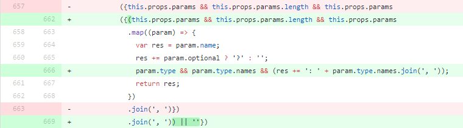

> 제가 개발 중인 JavaScript 정적 분석 도구 [DeepScan](https://deepscan.io)은 JavaScript의 일반적인 오류 외에도 최근 핫한 React를 잘 지원하려는 목표를 갖고 있습니다.
>
> ESLint나 주변 React 개발자들의 피드백을 통해 십여 종의 React 검증 규칙을 개발해 왔는데, 이 중에서 React를 처음 배우는 개발자들이 실수하기 쉬운 내용을 추려 시리즈로 연재합니다.
> * [React 개발자가 실수하기 쉬운 몇 가지 (1)]({{ site.baseurl }})
> * React 개발자가 실수하기 쉬운 몇 가지 (2)
> * [React 개발자가 실수하기 쉬운 몇 가지 (3)]({{ site.baseurl }})
{:.preface}

[지난 글]({{ site.baseurl }})에서 오픈소스 [wp-calypso](https://github.com/Automattic/wp-calypso)의 사례로 다음과 같은 React의 실수 패턴을 알아봤습니다.
 * React API의 오타
 * `render` 함수에서 잘못된 값을 반환
 * 이벤트 핸들러 함수를 잘못 지정한 경우
 * DOM element에서 잘못된 속성 지정

오늘은 다른 오픈소스의 사례로 더 다양한 실수 패턴을 알아보도록 하겠습니다.

* Table of Contents
{:toc}

## render 함수의 반환 값을 직접 사용
`ReactDOM.render` 함수에서 반환하는 `ReactComponent` 인스턴스를 사용하는 경우가 있습니다.

이 방법은 권장되지 않는데, 그 이유는 향후 React 버전에서 [렌더링이 비동기적으로 일어날 수 있고](https://facebook.github.io/react/docs/react-dom.html#render) 그 결과 반환 값을 즉시 사용하는 것으로는 `ReactComponent` 인스턴스를 얻을 수가 없기 때문입니다.

아래 오픈소스 [react-starter-kit](https://github.com/kriasoft/react-starter-kit)에서 `render` 함수의 반환 값을 그대로 사용하는데 이 값이 `undefined`가 되어 원하는 초기화가 수행되지 않을 수 있습니다.

<pre class="" data-start="" data-line="127" data-line-offset="121"><code class="language-javascript">import ReactDOM from 'react-dom';

let appInstance;

async function onLocationChange(location, action) {
    appInstance = ReactDOM.render(
      <App context={context}>{route.component}</App>,
      container,
      () => onRenderComplete(route, location),
    );
}

if (appInstance) {
  // Force-update the whole tree, including components that refuse to update
  deepForceUpdate(appInstance);
}
</code></pre>
[src/client.js](https://github.com/kriasoft/react-starter-kit/blob/1d6153ed75919075bdd13a7b9715418b546da05f/src/client.js)
{: .center}

이 경우는 `ref` 콜백 함수를 통해 인스턴스를 얻어야 합니다.
```javascript
function cb(instance) {
}

async function onLocationChange(location, action) {
    ReactDOM.render(
      <App context={context} ref={cb}>{route.component}</App>,
      container,
      () => onRenderComplete(route, location),
    );
}
```

### DeepScan Rule

DeepScan의 [ASYNC_RENDER_RETURN_VALUE](https://deepscan.io/docs/rules/async-render-return-value/) 규칙은 `render` 함수의 반환 값을 직접 사용하는 경우를 찾아 개발자의 실수를 방지할 수 있습니다.
<table class="table">
  <thead>
    <tr>
    </tr>
  </thead>
  <tbody>
    <tr>
      <td style="">Consider not using 'ReactDOM.render()' result because future versions of React may render components asynchronously.
<div class="highlighter-rouge"><pre class="highlight"><code class="err">appInstance = ReactDOM.render(
</code></pre></div>
      </td>
    </tr>
  </tbody>
</table>

## 이벤트 핸들러 함수에서 이벤트 전파가 중단되지 않는 경우
HTML에서는 이벤트 핸들러 함수에서 `false`를 반환하면 이벤트 전파 및 기본 동작이 중단됩니다.

하지만 React는 별도의 이벤트 시스템을 사용하고, 이벤트 전파나 기본 동작을 중단하려면 인자로 받은 React 이벤트 객체의 `stopPropagation()`이나 `preventDefault()`를 명시적으로 호출해야 합니다.

아래 오픈소스 [browser-laptop](https://github.com/brave/browser-laptop)의 예를 보면 `onMaximizeClick` 이벤트 핸들러에서 `return false` 같이 기존 방식대로 사용하고 있어 이벤트 전파가 중단되지 않습니다.

<pre class="" data-start="" data-line="43" data-line-offset="34"><code class="language-javascript">const React = require('react')

class WindowCaptionButtons extends ImmutableComponent {
  onMaximizeClick (e) {
    if (isFullScreen()) {
      // If full screen, toggle full screen status and restore window (make smaller)
      windowActions.shouldExitFullScreen(getCurrentWindowId())
      if (isMaximized()) windowActions.shouldUnmaximize(getCurrentWindowId())
      return false
    }
    return (!isMaximized()) ? windowActions.shouldMaximize(getCurrentWindowId()) : windowActions.shouldUnmaximize(getCurrentWindowId())
  }

  render () {
    const props = { tabIndex: -1 }

    return &lt;div&gt;
      &lt;div className='container'&gt;
        <button
          {...props}
          onClick={this.onMaximizeClick}
          title={locale.translation(this.maximizeTitle)}>
        </button>
      &lt;/div&gt;
    &lt;/div&gt;
  }
}
</code></pre>
[navigation/windowCaptionButtons.js](https://github.com/brave/browser-laptop/blob/87428bc2430fd743798ae910a17dcdb585141415/app/renderer/components/navigation/windowCaptionButtons.js)
{: .center}

### DeepScan Rule

DeepScan의 [BAD_EVENT_HANDLER_RETURN_FALSE](https://deepscan.io/docs/rules/bad-event-handler-return-false/) 규칙은 이벤트 핸들러로 사용되는 함수에서 `false`를 반환하는 경우를 찾아 개발자의 실수를 방지할 수 있습니다.
<table class="table">
  <thead>
    <tr>
    </tr>
  </thead>
  <tbody>
    <tr>
      <td style="">In React, returning false from an event handler has no effect. Consider using 'preventDefault()' or 'stopPropagation()' of the event object.
<div class="highlighter-rouge"><pre class="highlight"><code class="err">return false
</code></pre></div>
      </td>
    </tr>
  </tbody>
</table>

## JSX에서 JavaScript 주석을 사용하는 경우
JSX에서 `//`나 `/* */` 같은 JavaScript 주석을 사용할 경우 주의가 필요합니다.

주석이 JSX의 컴포넌트 하위 텍스트 노드로 인식되면 주석 내용이 브라우저 화면에 보이기 때문인데, 주석은 `{/* */}` 같이 중괄호로 감싸야 합니다.

아래 오픈소스 [belle](https://github.com/nikgraf/belle)에서는 `onUpdate should not be called for valueLink`라는 주석이 그대로 화면에 노출되는 문제가 있습니다.

<pre class="" data-start="" data-line="32" data-line-offset="19"><code class="language-javascript">import React from 'react';

export default React.createClass({
  render() {
    return (
      &lt;div&gt;
        &lt;h2&gt;Rating&lt;/h2&gt;

        &lt;Card&gt;

          <Button onClick={ this._updateRatingToThree }>Update Rating to value 3</Button>

          //onUpdate should not be called for valueLink
          &lt;h3&gt;ValueLink&lt;/h3&gt;

        &lt;/Card&gt;

      &lt;/div&gt;
    );
  }
});
</code></pre>
[components/RatingPlayground.js](https://github.com/nikgraf/belle/blob/d6472a632b2f1c62f6e8954cae659bee3e6d8a9d/examples/components/RatingPlayground.js)
{: .center}

이 경우는 다음과 같이 써야 합니다.
```javascript
{/* onUpdate should not be called for valueLink */}
<h3>ValueLink</h3>
```

반대로 `<h3>// is a double slash.</h3>` 같이 실제로 "//"를 써야 하는 경우 `<h3>{"// is a double slash."}</h3>`처럼 주석이 아닌 문자열임이 드러나도록 명확하게 쓰는 것이 좋은 습관으로 알려져 있습니다.

### DeepScan Rule

DeepScan의 [BAD_JSX_COMMENT](https://deepscan.io/docs/rules/bad-jsx-comment/) 규칙은 JSX 내에서 JavaScript 주석을 사용하는 경우를 찾아 개발자의 실수를 방지할 수 있습니다.
<table class="table">
  <thead>
    <tr>
    </tr>
  </thead>
  <tbody>
    <tr>
      <td style="">This text is recognized as a JSX child instead of a comment. Consider using JavaScript comment inside braces.
<div class="highlighter-rouge"><pre class="highlight"><code class="err">//onUpdate should not be called for valueLink
</code></pre></div>
      </td>
    </tr>
  </tbody>
</table>

## length 속성 검사
React에서 자식 엘리먼트(child element)를 `undefined`, `null`, `true` 또는 `false`로 지정한 경우 렌더링에서 제외됩니다. 따라서 선택적인 렌더링을 할 때 `cond && <div>...</div>` 같은 JSX 구문을 많이 사용합니다.

그런데 숫자 값 0에 대해선 이렇게 적용되지 않고 0이 그대로 화면에 출력됩니다.
즉 `array.length && <div>...</div>`에서 `array`가 비어 있다면 0이 출력되므로, 이 경우 `length` 속성을 직접 검사하는 대신 다음과 같이 사용해야 합니다.
 * `array.length > 0` 같은 비교 구문으로 사용
 * `array.length && <div>...</div> || ''` 같이 끝에 빈 문자열을 OR 조건으로 추가

아래 오픈소스 [react-native-macos](https://github.com/ptmt/react-native-macos)도 `length` 속성을 직접 검사하기 때문에 `this.props.params`가 비어 있다면 0이 출력됩니다.

<pre class="" data-start="" data-line="657" data-line-offset="644"><code class="language-javascript">var React = require('React');

var Method = React.createClass({
  render: function() {
    return (
      &lt;div className="prop"&gt;
        <Header level={4} className="methodTitle" toSlug={this.props.name}>
          {this.props.modifiers && this.props.modifiers.length && &lt;span className="methodType"&gt;
            {this.props.modifiers.join(' ') + ' '}
          &lt;/span&gt; || ''}
          {this.props.name}
          &lt;span className="methodType"&gt;
            ({this.props.params && this.props.params.length && this.props.params
              .map((param) => {
                var res = param.name;
                res += param.optional ? '?' : '';
                return res;
              })
              .join(', ')})
              {this.props.returns && ': ' + this.renderTypehint(this.props.returns.type)}
          &lt;/span&gt;
        </Header>
      &lt;/div&gt;
    );
  }
});
</code></pre>
[layout/AutodocsLayout.js](https://github.com/ptmt/react-native-macos/blob/5d32075363993191ba94605247992497f70aeb20/website/layout/AutodocsLayout.js)
{: .center}

이 [커밋](https://github.com/ptmt/react-native-macos/commit/a7a3922b89d821b9a34d26bdcc7676e747a27160#diff-0c2bccba86d026e1fc586ac3c113d4a9)을 보면 위에서 얘기한 것 같이 `|| ''` 조건을 붙여 수정한 것을 볼 수 있습니다.

{:width="100%"}

### DeepScan Rule

DeepScan의 [BAD_LENGTH_CHECK](https://deepscan.io/docs/rules/bad-length-check/) 규칙은 `length` 속성을 직접 검사하는 경우를 찾아 개발자의 실수를 방지할 수 있습니다.
<table class="table">
  <thead>
    <tr>
    </tr>
  </thead>
  <tbody>
    <tr>
      <td style="">Numeric value 0 can be rendered because 'this.props.params.length' itself is checked. Consider checking 'this.props.params.length > 0' instead.
<div class="highlighter-rouge"><pre class="highlight"><code class="err">({this.props.params && this.props.params.length && this.props.params
</code></pre></div>
      </td>
    </tr>
  </tbody>
</table>

## Wrap-Up

위에 제시된 코드들은 [데모 페이지](https://deepscan.io/demo/)에서 바로 붙여넣어 체크해 볼 수 있습니다.

오늘 살펴본 React 코드 오류는 다음과 같습니다.
 * render 함수의 반환 값을 직접 사용
 * 이벤트 핸들러 함수에서 이벤트 전파가 중단되지 않는 경우
 * JSX에서 JavaScript 주석을 사용하는 경우
 * length 속성 검사

특히 React를 처음 배우는 분들에게 도움이 되면 좋겠습니다.
