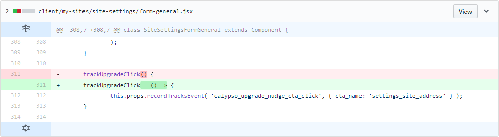
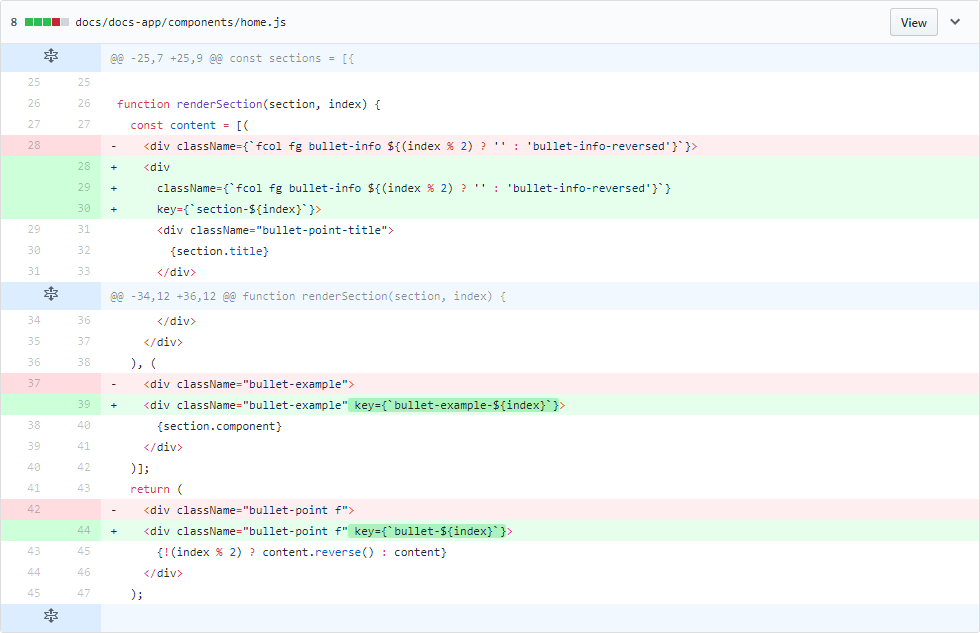

> 제가 개발 중인 JavaScript 정적 분석 도구 [DeepScan](https://deepscan.io)은 JavaScript의 일반적인 오류 외에도 최근 핫한 React를 잘 지원하려는 목표를 갖고 있습니다.
>
> ESLint나 주변 React 개발자들의 피드백을 통해 십여 종의 React 검증 규칙을 개발해 왔는데, 이 중에서 React를 처음 배우는 개발자들이 실수하기 쉬운 내용을 추려 시리즈로 연재합니다.
> * [React 개발자가 실수하기 쉬운 몇 가지 (1)]({{ site.baseurl }})
> * [React 개발자가 실수하기 쉬운 몇 가지 (2)]({{ site.baseurl }})
> * React 개발자가 실수하기 쉬운 몇 가지 (3)
{:.preface}

[지난 글]({{ site.baseurl }})에서 오픈소스의 사례로 다음과 같은 React의 실수 패턴을 알아봤습니다.
 * render 함수의 반환 값을 직접 사용
 * 이벤트 핸들러 함수에서 이벤트 전파가 중단되지 않는 경우
 * JSX에서 JavaScript 주석을 사용하는 경우
 * length 속성 검사

오늘도 다양한 실수 패턴을 알아보도록 하겠습니다.

* Table of Contents
{:toc}

## 이벤트 핸들러를 문자열로 지정한 경우
HTML에서는 이벤트 핸들러를 문자열로 지정합니다. `<image src="hello.png" onclick="alert('Hi')"/>` 같이 문자열에 스크립트 코드를 넣죠.

하지만 React의 이벤트 핸들러는 HTML과 달리 항상 함수 객체로 지정되어야 합니다. 이벤트 핸들러를 문자열로 지정하면 React에서 예외가 발생합니다.

[React](https://github.com/facebook/react)의 테스트 코드에서도 문자열로 지정된 이벤트 핸들러에 대한 체크를 볼 수 있습니다.

<pre class="" data-start="" data-line="28" data-line-offset="25"><code class="language-javascript">it('should prevent non-function listeners, at dispatch', () => {
  var node = ReactTestUtils.renderIntoDocument(
    &lt;div onClick="not a function" /&gt;,
  );
  expect(function() {
    ReactTestUtils.SimulateNative.click(node);
  }).toThrowError(
    'Expected onClick listener to be a function, instead got type string',
  );
});
</code></pre>
[\_\_tests\_\_/EventPluginHub-test.js](https://github.com/facebook/react/blob/197e184859140524e1de92abfc6d678bbc85b340/src/renderers/__tests__/EventPluginHub-test.js)
{: .center}

React의 이벤트 핸들러는 `<div onClick="console.log('clicked')">` 같이 쓰지 않고 아래처럼 함수 객체가 지정되어야 함을 기억하세요.
```javascript
    import React from 'react';

    class Hello extends React.Component {
        handleClick() {
            console.log('clicked');
        }

        render() {
            return (
                <div onClick={this.handleClick}>
                    Hello
                </div>
            );
        }
    }
```

### DeepScan Rule

DeepScan의 [BAD_EVENT_HANDLER](https://deepscan.io/docs/rules/bad-event-handler/) 규칙은 이벤트 핸들러에 문자열이 지정된 경우를 찾아 개발자의 실수를 방지할 수 있습니다.
<table class="table">
  <thead>
    <tr>
    </tr>
  </thead>
  <tbody>
    <tr>
      <td style="">Event handler of a React element cannot be a string. Consider specifying a function instead.
<div class="highlighter-rouge"><pre class="highlight"><code class="err">&lt;div onClick="not a function" /&gt;,
</code></pre></div>
      </td>
    </tr>
  </tbody>
</table>

## 이벤트 핸들러 함수가 올바로 바인딩 되지 않은 경우
이벤트 핸들러 관련해서 하나 더 보도록 하죠.

React는 이벤트 핸들러를 호출할 때 `this` 객체를 제공하지 않기 때문에 이벤트 핸들러 함수에서 `this`의 속성에 접근하는 경우 `TypeError` 예외가 발생합니다.

이를 해결하기 위해서는 `Function.prototype.bind()`를 이용해 `this` 객체를 명시적으로 지정하거나 ES6의 화살표 함수(arrow function)를 사용해야 합니다. 참고로 `React.createClass()`에서는 멤버 함수가 자동으로 `this` 객체와 바인딩 되므로 이를 클래스로 변환할 때는 특히 주의할 필요가 있습니다.

아래 오픈소스 [wp-calypso](https://github.com/Automattic/wp-calypso)의 예를 보면 이벤트 핸들러로 지정된 `this.trackUpgradeClick` 함수가 제대로 바인딩 되어 있지 않아 에러가 발생합니다.

<pre class="" data-start="" data-line="279,282,285,312" data-line-offset="265"><code class="language-javascript">import React, { Component } from 'react';

class SiteSettingsFormGeneral extends Component {
	blogAddress() {
		translate(
			'Buy a {{domainSearchLink}}custom domain{{/domainSearchLink}}, ' +
			'{{mapDomainLink}}map{{/mapDomainLink}} a domain you already own, ' +
			'or {{redirectLink}}redirect{{/redirectLink}} this site.',
			{
				components: {
					domainSearchLink: (
						<a href={ '/domains/add/' + site.slug } onClick={ this.trackUpgradeClick } />
					),
					mapDomainLink: (
						<a href={ '/domains/add/mapping/' + site.slug } onClick={ this.trackUpgradeClick } />
					),
					redirectLink: (
						<a href={ '/domains/add/site-redirect/' + site.slug } onClick={ this.trackUpgradeClick } />
					)
				}
			}
		)


		return (
			&lt;FormFieldset className="site-settings__has-divider"&gt;
				&lt;FormLabel htmlFor="blogaddress"&gt;{ translate( 'Site Address' ) }&lt;/FormLabel&gt;
				&lt;div className="site-settings__blogaddress-settings"&gt;
					<FormInput
						name="blogaddress"
						type="text"
						id="blogaddress"
						value={ site.domain }
						disabled="disabled" />
					{ customAddress }
				&lt;/div&gt;
				{ addressDescription }
			&lt;/FormFieldset&gt;
		);
	}

	trackUpgradeClick() {
		this.props.recordTracksEvent( 'calypso_upgrade_nudge_cta_click', { cta_name: 'settings_site_address' } );
	}
}
</code></pre>
[site-settings/form-general.jsx](https://github.com/Automattic/wp-calypso/blob/a843773ea709cca3b078a4391ae295335794a1ad/client/my-sites/site-settings/form-general.jsx)
{: .center}

다행히 이 [커밋](https://github.com/Automattic/wp-calypso/commit/ea5848efa50b071da28529580d2e7778a2ee2dc9)에서 `trackUpgradeClick`을 화살표 함수로 변경한 것을 볼 수 있습니다.

{:width="100%"}

### DeepScan Rule

DeepScan의 [EVENT_HANDLER_INVALID_THIS](https://deepscan.io/docs/rules/event-handler-invalid-this/) 규칙은 이벤트 핸들러 함수가 `this` 객체와 바인딩 되지 않은 경우를 찾아 개발자의 실수를 방지할 수 있습니다.
<table class="table">
  <thead>
    <tr>
    </tr>
  </thead>
  <tbody>
    <tr>
      <td style="">Function 'this.trackUpgradeClick' is used as a React event handler without 'this' binding. But 'this' object is accessed in the function body at line 312.
<div class="highlighter-rouge"><pre class="highlight"><code class="err"><a href={ '/domains/add/' + site.slug } onClick={ this.trackUpgradeClick } />
</code></pre></div>
      </td>
    </tr>
  </tbody>
</table>

`trackUpgradeClick` 함수 내부인 312 라인에서 `this` 객체가 사용되기 때문에 문제가 된다는 것을 바로 알 수 있네요.

## 엘리먼트의 스타일 속성을 잘못 지정한 경우
이벤트 핸들러를 문자열로 지정할 수 없는 것과 유사하게 React는 `style` 속성에 CSS 규칙을 표현하는 문자열을 허용하지 않습니다.

React에서는 HTML과 달리 `style` 속성을 항상 객체로 지정해야 하고 객체, `null` 또는 `undefined` 외의 값을 지정한 경우 예외가 발생합니다.

[React](https://github.com/facebook/react)의 테스트 코드에서도 이에 대한 체크를 볼 수 있습니다.

<pre class="" data-start="" data-line="1171" data-line-offset="1167"><code class="language-javascript">    it('should report component containing invalid styles', () => {
      class Animal extends React.Component {
        render() {
          return <div style={1} />;
        }
      }

      expect(function() {
        ReactDOM.render(&lt;Animal /&gt;, container);
      }).toThrowError(
        'The `style` prop expects a mapping from style properties to values, ' +
          "not a string. For example, style={{marginRight: spacing + 'em'}} " +
          'when using JSX.\n\nThis DOM node was rendered by `Animal`.',
      );
    });
</code></pre>
[\_\_tests\_\_/ReactDOMComponent-test.js](https://github.com/facebook/react/blob/197e184859140524e1de92abfc6d678bbc85b340/src/renderers/dom/shared/__tests__/ReactDOMComponent-test.js)
{: .center}

### DeepScan Rule

DeepScan의 [BAD_STYLE_PROP](https://deepscan.io/docs/rules/bad-style-prop/) 규칙은 `style` 속성이 객체가 아닌 값으로 지정된 경우를 찾아 개발자의 실수를 방지할 수 있습니다.
<table class="table">
  <thead>
    <tr>
    </tr>
  </thead>
  <tbody>
    <tr>
      <td style="">'style' prop of a React DOM element cannot be a numeric value. Consider specifying an object instead.
<div class="highlighter-rouge"><pre class="highlight"><code class="err">return <div style={1} />;
</code></pre></div>
      </td>
    </tr>
  </tbody>
</table>

## 자식 엘리먼트의 key 속성을 지정하지 않은 경우
React에서는 DOM 트리를 업데이트할 때 [`key` 속성을 활용한 diff 알고리즘]((https://facebook.github.io/react/docs/reconciliation.html#recursing-on-children))을 통해 렌더링을 최적화합니다.

그런데 DOM 노드의 각 자식 엘리먼트에 `key` 속성이 없으면 해당 diff 알고리즘을 활용하지 못하고 렌더링 성능에 영향을 줄 수 있습니다. React에서 `key` 속성이 없을 경우 경고하는 이유이기도 하죠.

따라서 엘리먼트가 부모 노드의 자식으로서 컬렉션에 포함되는 경우 `key` 속성을 지정하는 습관을 가져야 합니다.

아래 오픈소스 [react-vis](https://github.com/uber/react-vis)도 `key` 속성 없이 사용하는데,

<pre class="" data-start="" data-line="28,37" data-line-offset="25"><code class="language-javascript">function renderSection(section, index) {
  const content = [(
    <div className={`fcol fg bullet-info ${(index % 2) ? '' : 'bullet-info-reversed'}`}>
      &lt;div className="bullet-point-title"&gt;
        {section.title}
      &lt;/div&gt;
      &lt;div className="bullet-point-text"&gt;
        {section.text}
      &lt;/div&gt;
    </div>
  ), (
    &lt;div className="bullet-example"&gt;
      {section.component}
    &lt;/div&gt;
  )];
  return (
    &lt;div className="bullet-point f"&gt;
      {!(index % 2) ? content.reverse() : content}
    &lt;/div&gt;
  );
}
</code></pre>
[components/home.js](https://github.com/uber/react-vis/blob/baf8a946bc39b9e36c597107f347e532b8b26f62/docs/docs-app/components/home.js)
{: .center}

향후 [커밋](https://github.com/uber/react-vis/commit/6d003947f5a9807f129be8d0cb463c819d617820)에서 `key` 속성이 추가되었음을 볼 수 있습니다.

{:width="100%"}

### DeepScan Rule

DeepScan의 [MISSING_KEY_PROP](https://deepscan.io/docs/rules/missing-key-prop/) 규칙은 컬렉션 내의 엘리먼트에서 `key` 속성이 빠진 경우를 찾아 개발자의 실수를 방지할 수 있습니다.
<table class="table">
  <thead>
    <tr>
    </tr>
  </thead>
  <tbody>
    <tr>
      <td style="">Each child React element in a collection should have a 'key' prop.
<div class="highlighter-rouge"><pre class="highlight"><code class="err">[(
    &lt;div className="bullet-example"&gt;
      {section.component}
    &lt;/div&gt;
)]
</code></pre></div>
      </td>
    </tr>
  </tbody>
</table>

## Wrap-Up

위에 제시된 코드들은 [데모 페이지](https://deepscan.io/demo/)에서 바로 붙여넣어 체크해 볼 수 있습니다.

오늘 살펴본 React 코드 오류는 다음과 같습니다.
 * 이벤트 핸들러를 문자열로 지정한 경우
 * 이벤트 핸들러 함수가 올바로 바인딩 되지 않은 경우
 * 엘리먼트의 스타일 속성을 잘못 지정한 경우
 * 자식 엘리먼트의 key 속성을 지정하지 않은 경우

특히 React를 처음 배우는 분들에게 도움이 되길 바라며 오늘 글을 마칩니다.
